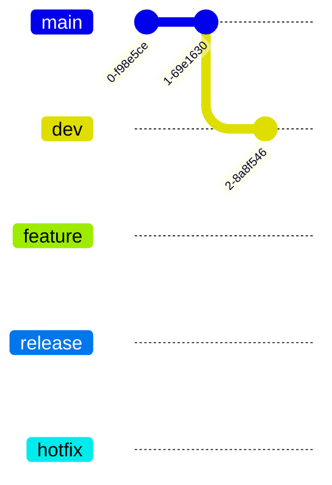

# Caproni

## git tree of the project 


```main``` is the main branch where the source code of HEAD always reflects a production-ready state.

```dev``` is the branch where the source code of HEAD always reflects a state with the latest delivered development changes for the next release.

```feature``` branches are used to develop new features for the upcoming or a distant future release.

```release``` branches support preparation of a new production release.
hotfix branches are used to quickly patch production releases

```hotfix``` branches are very much like release branches in that they are also meant to prepare for a new production release, albeit unplanned. They arise from the necessity to act immediately upon an undesired state of a live production version.



